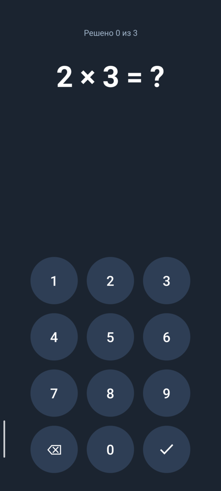
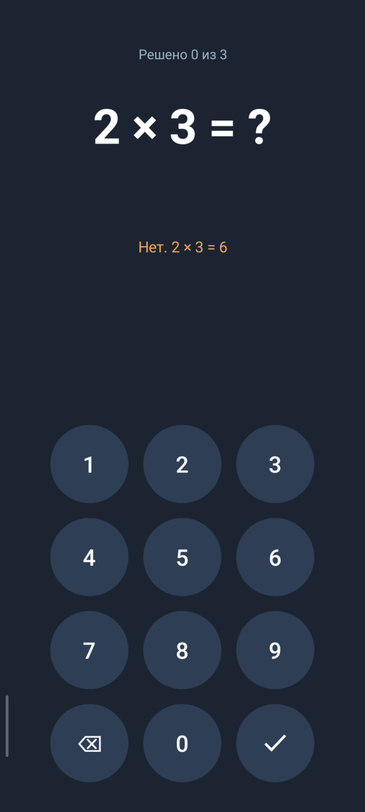
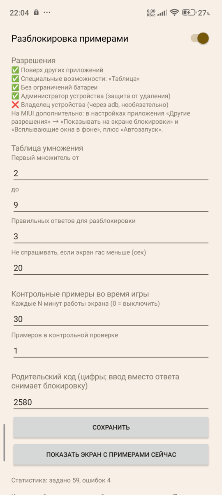

# Таблица (mathlock)

Детский экран блокировки для Android: вместо PIN-кода телефон разблокируется
случайными примерами из таблицы умножения.

*Android lock screen for kids: the phone unlocks by solving multiplication-table
problems instead of a PIN. Java, no dependencies.*

| Экран блокировки | Неверный ответ | Настройки |
|:---:|:---:|:---:|
|  |  |  |

## Установка

Готовый APK — в [Releases](https://github.com/fedor35/mathlock/releases/latest)
(Android 8.0+). После установки открыть «Таблица», выдать разрешения кнопками в
приложении, включить «Разблокировка примерами» и сменить родительский код.
Системную блокировку перевести в «Провести по экрану» — иначе после примеров
телефон всё равно спросит PIN.

## Как устроено

- Системная блокировка переводится в «Провести по экрану» (без PIN).
- Служба переднего плана следит за экраном: погас → телефон «заблокирован»;
  включился → поверх экрана блокировки показывается `QuizActivity` с примерами.
- Служба специальных возможностей (`WatchService`) возвращает примеры, если
  ребёнок нажал «Домой» или «Недавние». Содержимое экранов не читается.
- Если приложение остановится, телефон просто откроется без примеров.
- Родительский код (по умолчанию 2580) вводится вместо ответа и снимает блокировку.
- Если включить приложение владельцем устройства (`dpm set-device-owner`), экран
  с примерами пинится намертво. На телефонах с аккаунтами это недоступно.

Настройки: диапазон первого множителя, число правильных ответов, льготный период
(короткое гашение экрана не спрашивает примеры), родительский код, статистика ошибок.

Сборка: `cd android && JAVA_HOME=/usr/lib/jvm/java-17-openjdk ./gradlew assembleDebug`.
Подписанный релиз — `assembleRelease` с переменными `MATHLOCK_KEYSTORE` и
`MATHLOCK_KEYSTORE_PASSWORD` (ключ хранится вне репозитория).

Выдача разрешений через adb (без них тоже можно, кнопками в приложении):

```
P=dev.gubenkov.mathlock
adb install -r -g app-debug.apk
adb shell appops set $P SYSTEM_ALERT_WINDOW allow
adb shell dumpsys deviceidle whitelist +$P
adb shell settings put secure enabled_accessibility_services $P/$P.WatchService
adb shell settings put secure accessibility_enabled 1
adb shell locksettings clear --old <старый PIN>
```

## На каком телефоне проверено

| | |
|---|---|
| Телефон | Xiaomi Redmi Note 11 (2201117TG, spes), Snapdragon 680, 4 ГБ ОЗУ |
| Система | HyperOS 1.0 (V816.0.8.0.TGCMIXM), Android 13 |
| Особенности | 4 Google-аккаунта и Family Link (profile owner) — владельцем устройства приложение стать не может, поэтому работает через службу спецвозможностей |

Что проверено на нём (04.10 и 06.10.2026):

- после включения экрана кнопкой поверх экрана блокировки появляются примеры;
- «Домой» и «Недавние» не выпускают с экрана примеров;
- родительский код снимает блокировку;
- блокировка кнопкой не зажигает экран снова (исправлено 06.10.2026);
- после перезагрузки блокировка встаёт сама: HyperOS не доносит до приложения
  `BOOT_COMPLETED`, служба запускается из службы спецвозможностей;
- удалить приложение без кода нельзя (администратор устройства + код на вход в Настройки).

Особенности HyperOS: `am force-stop` и даже `adb install -r` выключают службу
спецвозможностей — после установки её нужно включить заново (команды выше).

На других телефонах не проверялось. Родительский код по умолчанию (2580) стоит
сменить в настройках сразу после установки.
